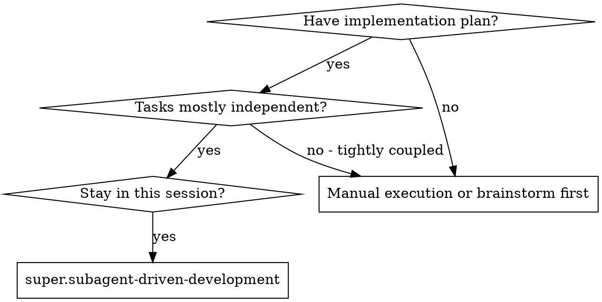

# Subagent-Driven Development

Execute the plan by dispatching a fresh subagent per task, with two-stage review after each: spec compliance first, then code quality.

**Why subagents:** You delegate to specialized agents with isolated context, crafting their instructions precisely so they stay focused. They never inherit your session history — you construct exactly what they need, which also preserves your context for coordination.

**Core principle:** Fresh subagent per task + two-stage review (spec then quality) = high quality, fast iteration.

> **Cardinal rule — you are the orchestrator, never the implementer.** You do NOT write, edit, or refactor production code or tests yourself. Your *only* mechanism for implementing a task is dispatching a fresh implementer subagent via the Agent/Task tool — **one subagent per task, no exception, even a plan with a single task or a one-line change.** If you catch yourself opening a file to edit, writing code in your turn, or thinking "this is small, I'll do it inline," STOP: that is the exact failure this skill prevents. Inline work silently skips the two-stage review, per-task model selection, and the verification gate — every quality mechanism below assumes a dispatched subagent produced the code. **Running read-only verification is NOT implementing** — `super.verification-before-completion` (and the serialized integration barrier in `super.parallel-subagent-in-tree`) require *you*, the controller, to run the test suite / typecheck / build and confirm evidence yourself. The prohibition is on *producing* code, never *observing* it. The lone exception is the **reviewers' findings loop**, which still dispatches a fresh implementer to fix each finding — never an inline patch.

**Continuous execution:** Do not pause to check in between tasks. Execute all tasks without stopping. The only reasons to stop: BLOCKED status you cannot resolve, ambiguity that genuinely prevents progress, or all tasks complete. "Should I continue?" prompts waste time — you were asked to execute the plan, so execute it.

## When to Use



## The Process

### Task Tracker Integration

Before extracting tasks, locate the tasks index.

**Discovery:** The path is passed explicitly in context (e.g., `docs/superpowers/<feature-name>/plans/tasks-<feature-name>.md`). If not passed, look for a `tasks-*.md` file in the feature's `plans/` directory.

> **Deterministic task parsing (preferred):**
> ```bash
> node scripts/parse-tasks.cjs --tasks-index <path>
> ```
> Outputs JSON with `found`, `allDone`, `completed[]`, `pending[]`, `inProgress[]`, `mismatches[]`. Use `completed` to skip done tasks (session resume), `pending`+`inProgress` for what remains. Any `mismatches` between index and task file require manual resolution before proceeding.
> **Fallback:** Read and parse the tasks index manually if the script is unavailable.

### Session State Re-Entry Guard

> **Run this FIRST — before the Memory Gate, before Caveman, before any dispatch.** It keeps execution correct when a session resumes **directly into this skill** after a compaction (auto or manual) **without** re-entering `super.using-superpowers`. Every `session_*` variable is session-only; a compaction wipes them, and `super.using-superpowers` — which normally derives them at session start — does **not** run on a mid-execution resume. Skip this guard and every variable reverts to its `false`/default: caveman never activates, `/simplify` never runs, the final `/code-review` pass never fires. The work still "completes" but every opt-in is silently dropped — nothing warns you, because a default-`false` flag looks identical to a deliberately-disabled one.

**Run this unconditionally — never gate it on whether the variables still look intact.** That gate is itself the failure mode: a wiped flag is indistinguishable from a deliberately-disabled one, so any judgment about whether re-deriving is "needed" can guess wrong. The call is deterministic, read-only, and idempotent, so always re-derive the *entire* set in one call — never restore only caveman, never hand-map the variables or default any to off:

```bash
node <super.using-superpowers-base-dir>/scripts/derive-session-state.cjs \
  --platform claude-code --repo-root "$(git rev-parse --show-toplevel)"
```

Restore each `session_*` variable from the script's `sessionState` object. That script is the single source of truth for the `preferences.X.Y → session_*` mapping and for platform gating (returning the safe default for native vars that don't apply to the current platform), so there is no per-variable table to keep in sync here. Pass the `--platform` matching where you run (`claude-code`; or `copilot`, `codex`, `gemini` elsewhere).

The two caveman latches are **not** part of `sessionState` — they are runtime bookkeeping, not configuration. A compaction wipes the live caveman skill, so treat `session_caveman_in_effect` and `session_caveman_prompted` as `false`: the Caveman State Check below re-loads caveman when `session_caveman_active` resolves true.

**Then resume any interrupted task.** Check the task files (or `parse-tasks.cjs`) for a `**Status:** IN_PROGRESS` task — it was interrupted before the compaction. Re-read its `## Passos` and the current state of its touched files to resume rather than restart.

> **Compaction invariant:** the physical task files (`task-NN.md` and `tasks-<feature-name>.md`) are the single source of truth for completion. A task is complete only if its file says `Status: DONE` and `tasks-<feature>.md` shows `[x]`. TodoWrite entries and session memory do not count.

### Branch Guard

> **Run on a fresh start, before the first implementer dispatch.** Skip on a session resume — if any task is already `IN_PROGRESS` or `DONE`, the branch is already established (the § Session State Re-Entry Guard path) and re-checking would only re-prompt mid-feature.

Implementers commit per task, so the branch you start on is where the **entire feature** lands. Before the first dispatch, confirm you are not about to commit feature work straight onto the repository's default branch:

```bash
BRANCH=$(git rev-parse --abbrev-ref HEAD)
DEFAULT=$(git symbolic-ref --quiet --short refs/remotes/origin/HEAD 2>/dev/null | sed 's@^origin/@@')
DEFAULT=${DEFAULT:-$(git branch --list main master | tr -d ' *+' | head -1)}
echo "current=$BRANCH default=${DEFAULT:-<none>}"
```

- **`BRANCH` is `main`/`master`, or equals `DEFAULT`** → you are on the default branch. **STOP and ask the user before dispatching** — offer to create a feature branch (`git checkout -b <feature-name>`) or to proceed on the default branch with their explicit consent. Do not dispatch the first implementer until they choose. This is the *active* form of the "never start on main/master without consent" Red Flag: a deterministic check at the point of no return, not a reminder you can read past.
- **`BRANCH` is a non-default branch** → the feature has its own branch; proceed.
- **`BRANCH` is `HEAD` (detached), or the workspace is a worktree** → an externally-managed or isolated workspace; proceed (finishing handles integration for those).

### Memory Gate Check

> **Conditional on `session_memory_enabled`.** If `session_memory_enabled = false`, skip this section and proceed to Caveman Mode Activation. (After compaction it must already be restored by § Session State Re-Entry Guard above — never read `false` just because the variable was wiped.)

> **When enabled — do not skip.** This is the entry guard for the Executando state. Memory must have been persisted at the end of `super.writing-plans`. If it wasn't, persist now before dispatching any subagent.

Before dispatching the first task subagent, verify the planning artifacts are persisted:

```bash
pmem search "<feature-name>" --limit 3
```

- **If results include entries for this feature** (decisions, scope, artifact paths): memory present — proceed.
- **If no results**: memory was not persisted during planning. Run the full persistence procedure now — read `super.writing-plans/SKILL.md § Memory Persistence` and `super.writing-plans/references/memory-persistence.md` for the exact `pmem add` calls (3 entries: decisions, scope, artifact paths). Do not dispatch any task subagent until all three are written.

### Caveman Mode Activation

#### Caveman State Check

The § Session State Re-Entry Guard above has already restored `session_caveman_active`/`session_caveman_level` (and every other `session_*` variable) after any compaction, and reset `session_caveman_in_effect` to `false`. Now check session caveman state (defined in `super.using-superpowers` policy):

1. **If `session_caveman_active = false` AND `session_caveman_prompted = false`:** Ask the dynamic question (see `super.using-superpowers` Caveman Mode section) and record the result.
2. **If `session_caveman_active = true` AND `session_caveman_in_effect = false`:** Invoke the `caveman` skill at `session_caveman_level` (e.g., `/caveman full`), then set `session_caveman_in_effect = true`. If `session_caveman_in_effect` is already `true` (activated at the gate, or re-activated post-compaction by `super.using-superpowers`), **do not re-invoke** — it is already loaded; re-invoking only wastes tokens. Caveman stays active through all tasks, spec reviews, code quality reviews, and the QA gate.
3. **Before invoking `super.finishing-a-development-branch`:** Explicitly deactivate caveman — say "normal mode" or "stop caveman" — and set `session_caveman_in_effect = false`. Finalizando requires clear human-facing communication.

**Subagent propagation (deterministic — do not hand-assemble).** Every subagent prompt (implementer, spec reviewer, code quality reviewer, QA subagents) gets its Caveman Mode block from the renderer, never from memory:

```bash
node <super.using-superpowers-base-dir>/scripts/render-caveman-block.cjs \
  --active <session_caveman_active> --level <session_caveman_level>
# add --format field for the code-quality reviewer's CAVEMAN: field
```

Paste the script's `block` field verbatim into the prompt. When `session_caveman_active = false` the block is the empty string — omit the section. The wording lives in one place; the controller copies it, it does not compose it (the old fill-in-the-blank placeholder was a judgment call the controller mis-filled, so dispatched subagents never activated caveman).

**If a tracker exists:**
1. Read the tasks index (`tasks-<feature-name>.md`).
2. Tasks marked `[x]` are completed — skip them entirely (session resume).
3. For each remaining `[ ]` task, read the individual task file for full context.
4. **Read PRD and Spec from each task:** before dispatching the implementer, read the `**PRD:**` and `**Spec:**` fields from the task file header and include both files' content in the subagent's context alongside the task steps. The **Spec** is always required: if missing, empty, or its path does not resolve on disk, stop and resolve it before dispatching. The **PRD** is optional — `**PRD:** N/A` is valid (pass `N/A` to the implementer); only a non-`N/A` PRD path that fails to resolve is an error. Never dispatch an implementer without its Spec context (same stop-and-resolve handling as a status `mismatch`).
5. **Before dispatching each implementer:** physically write the change to `task-NN.md` on disk — `**Status:** PENDING` → `**Status:** IN_PROGRESS`. A real file edit, not a TodoWrite entry or mental note.

   > **Deterministic status edit (preferred):** the idempotent script anchors on the `**Status:**` line so it can't corrupt an adjacent field, and re-running is a safe no-op:
   > ```bash
   > node <super.subagent-driven-development-base-dir>/scripts/mark-task-status.cjs \
   >   --task-file <path/to/task-NN.md> --status IN_PROGRESS
   > ```
   > **Fallback:** edit the `**Status:**` line manually if the script is unavailable.
6. When ALL gates pass (super.verification-before-completion ✅ + spec review ✅ + code quality ✅), make **two physical edits on disk** (mandatory even if already marked complete in TodoWrite): flip the index checkbox `- [ ] N.` → `- [x] N.` in `tasks-<feature-name>.md` **and** set `**Status:** DONE` in `task-NN.md`.

   > **Deterministic update (preferred):** one call does both edits atomically and idempotently — sets the task file Status and flips the matching index checkbox (`[x]` for DONE):
   > ```bash
   > node <super.subagent-driven-development-base-dir>/scripts/mark-task-status.cjs \
   >   --task-file <path/to/task-NN.md> --status DONE \
   >   --tasks-index <path/to/tasks-<feature-name>.md> --task-number N
   > ```
   > Inspect the JSON: `statusChanged` and `indexUpdated` confirm the writes; any `errors` (e.g. task number not found) require manual resolution.
   > **Fallback:** make the two edits manually if the script is unavailable.

   These edits are the authoritative audit record. `super.finishing-a-development-branch` reads the index directly to verify all tasks are `[x]` — if the files are not edited on disk, the branch cannot be finished and the history cannot be audited.

**If no tracker exists:**
Extract tasks from a plan file if one was passed directly. Note in the log: "No task tracker found; using plan file directly."

**Setup:** Read plan + task tracker, extract tasks, skip completed ones, create TodoWrite.

**Per task (sequential):**
1. Dispatch implementer subagent (`./agents/implementer.md`). If it asks questions → answer/provide context → re-dispatch.
2. Implementer implements, tests, commits, self-reviews.
3. Dispatch spec reviewer subagent (`./agents/spec-reviewer.md`). If code does not match spec → implementer fixes → re-review. Loop until ✅.
4. Dispatch code quality reviewer subagent (`./agents/code-quality-reviewer.md`). If not approved → implementer fixes → re-review. Loop until ✅.
   > **The review loop is capped.** If a reviewer keeps rejecting the same task across ~3 rounds without converging (each fix trades one finding for another, or reintroduces a prior one), stop and treat it like a `BLOCKED` implementer — apply § Handling Implementer Status (more context → more capable model → split the task → escalate to the human). A non-converging review means something deeper is wrong.
5. Run `super.verification-before-completion`.
6. Update task tracker: flip `[x]` + set `Status: DONE`.

> **`/simplify` (opt-in, Claude Code only; additive — never a review).** If `session_simplify_enabled`, run `/simplify` on the task's changed files between step 2 and step 3 (after tests green, before the reviews; skip no-code tasks). It *applies* cleanups, so it never duplicates the spec/quality gates. The optional final review pass (`/code-review` on Claude Code, `review` on Copilot CLI) is handled at "After all tasks done" below. Off or non-matching platform → skip. See `super.using-superpowers/references/claude-code-tools.md` / `copilot-tools.md`.

**After all tasks done:**
1. **Final code review of the entire implementation.** Always dispatch the final code reviewer subagent (broad: architecture / security / testing / project principles). **Then, as an extra bug-focused pass: if `session_code_review_final_enabled` (Claude Code) → also run `/code-review <session_code_review_effort>` (default `medium`); if `session_copilot_review_final_enabled` (Copilot CLI) → also run the native `review` skill.** These are complementary layers (broad review + focused bug net), not duplicate.

   **Findings are fixed, not just reported — same fix loop as the per-task gates.** Pool the findings from all passes that ran. For each **Critical / Important** finding, dispatch a fresh implementer subagent (`./agents/implementer.md`) to fix it — the controller orchestrates, it does not patch inline — then **re-run the review pass that raised it** on the fix. Loop until no Critical/Important findings remain — **capped**: if the same finding survives ~2 fix rounds, stop and route it to **super.systematic-debugging** (an oscillating finding is a deeper design issue, not a nit) or escalate to the human; never loop indefinitely. **Minor** findings: fix if cheap, otherwise list them for the user; they do not block. Do not proceed to the QA gate or finishing while a Critical/Important finding is open. The per-task spec + quality gates already ran and are unaffected.
2. PRD exists? → No PRD: go to step 4 (the done-state gate). PRD found: ask user whether to run the QA gate.
3. If user confirmed → invoke `super.user-story-verification` (QA Gate). On `FAILED` → **STOP and report failing user stories**; on `PASSED`/`PARTIAL` → continue. If user declined → continue.
4. **Done-state gate (deterministic — before handoff).** The QA gate verifies *features*, not bookkeeping. Run `parse-tasks.cjs` with `--assert-all-done` — it exits non-zero if any task is not `[x]`/`Status: DONE`, or if the index and a task file disagree:

   ```bash
   node <super.subagent-driven-development-base-dir>/scripts/parse-tasks.cjs \
     --tasks-index <path> --assert-all-done
   ```

   If it exits non-zero, fix the open or inconsistent tasks with `mark-task-status.cjs` while the execution machinery is still loaded — `super.finishing-a-development-branch` re-runs this same gate as a backstop, so a skip here surfaces there anyway.
5. Pass the tasks index path to `super.finishing-a-development-branch`, then use it.

## QA Gate — User Story Verification

After the final code reviewer approves, and **before** invoking `super.finishing-a-development-branch`, run the QA Gate if a PRD exists.

**PRD discovery order** (same logic as `super.writing-plans`):
1. Explicit path in context (forwarded from `super.generating-prd` this session)
2. Deterministic derivation: `docs/superpowers/<feature-name>/prd/prd-<feature-name>.md`
3. Directory scan: files with `prd-` prefix in `docs/superpowers/<feature-name>/prd/`

**If no PRD is found:** Skip the QA Gate and proceed directly to `super.finishing-a-development-branch`.

**If a PRD is found:** Ask the user whether to run the QA gate before proceeding:

```
A PRD was found for this feature. Do you want to run super.user-story-verification (QA gate)
to verify all user stories against the implementation before finishing the branch?
This will dispatch parallel subagents to check acceptance criteria and collect evidence.
```

| User decision | Action |
|--------------|--------|
| **Yes / confirmed** | Invoke `super.user-story-verification`, passing the PRD path, feature name, and test runner command |
| **No / declined** | Skip the gate — proceed directly to `super.finishing-a-development-branch` |

**When QA runs and returns a result:**

| QA Result | Action |
|-----------|--------|
| `PASSED` | Continue — invoke `super.finishing-a-development-branch` |
| `PARTIAL` | Continue — invoke `super.finishing-a-development-branch` (note partial coverage in handoff) |
| `FAILED` | **STOP.** Report the failing user stories. Do not invoke `super.finishing-a-development-branch` until the user resolves them and re-runs. |

The QA report is saved to `docs/superpowers/<feature-name>/qa/qa-report-<feature-name>.md` by `super.user-story-verification`.

**Caveman + QA Gate:** `super.user-story-verification` runs in the `Verificando` state — caveman remains active during QA. Pass the caveman block to the QA skill invocation context so its subagents also use caveman. Deactivate caveman only after QA returns and **before** invoking `super.finishing-a-development-branch`:

```
[QA Gate result received]
→ Deactivate caveman: "normal mode"  (and set session_caveman_in_effect = false)
→ Invoke super.finishing-a-development-branch
```

## Model Selection

**Set an explicit `model:` on every subagent you dispatch — never inherit yours by omission.** Omitting `model:` makes the Task/Agent tool inherit the controller's model, so a controller on the most-capable model silently runs *every* implementer and reviewer on it too — wasting tokens for no quality gain. Resolve each task's tier to a model and pass it explicitly; omission is a Red Flag. Use the *least powerful* model that does each role well, reserving capable models for genuine judgment (architecture, design, ambiguous specs, review). A tier may legitimately resolve to the controller's own model — that is fine when chosen *for the task* and passed explicitly; the bug is inheriting by omission without resolving the tier.

Each task carries a `**Tier:**` (`cheap` | `standard` | `capable`) in its file header (written by `super.writing-plans`; surfaced by `parse-waves.cjs` as `suggestedTier`). Read it, resolve via preferences `model_tiers.<tier>` or "auto" (dynamic by harness capability), and pass as `model:`. Reviewers run at the task's tier, floored at `standard`. When no tier is available, infer from signals and default to `standard` if ambiguous.

> Full policy (tier table, reviewer rules, `parse-waves.cjs` fields, "auto" resolution, no-tier fallback): **`references/model-selection.md`**. This is the canonical policy that `super.parallel-subagent-development`, `super.parallel-subagent-in-tree`, and `super.dispatching-parallel-agents` defer to.

## Handling Implementer Status

Implementer subagents report one of four statuses:

**DONE:** Proceed to spec compliance review.

**DONE_WITH_CONCERNS:** Completed but flagged doubts. Read them first. If about correctness or scope, address before review. If observations (e.g., "this file is getting large"), note and proceed.

**NEEDS_CONTEXT:** Provide the missing context and re-dispatch.

**BLOCKED:** Assess the blocker:
1. Context problem → provide more context, re-dispatch with the same model.
2. Needs more reasoning → re-dispatch with a more capable model.
3. Too large → break into smaller pieces.
4. Plan itself is wrong → escalate to the human.

**Never** ignore an escalation or force the same model to retry without changes. If the implementer is stuck, something needs to change.

## Handling Implementation Bugs

The per-task review loop handles spec and code-quality *findings*. A different failure — a verified bug, failing test, or unexpected runtime behavior surfacing while a task is implemented — is a debugging problem, not a review nit. Invoke **super.systematic-debugging** with the failing context (`DepurandoExec` state in the diagram); once root cause is found, fix applied, and verified, resume the task's normal gates. Follow super.systematic-debugging's own discipline and **caps** attempts — ~3 failed fixes stops to question architecture or the human, so this never loops forever. Don't paper over a symptom to keep moving.

## Prompt Templates

- `./agents/implementer.md` - Dispatch implementer subagent
- `./agents/spec-reviewer.md` - Dispatch spec compliance reviewer subagent
- `./agents/code-quality-reviewer.md` - Dispatch code quality reviewer subagent

## Example Workflow

See `references/example-workflow.md` for an end-to-end transcript (session resume, per-task dispatch + reviews, final review, QA gate, handoff).

## Suggesting Commit Messages

This applies **only when `workflow.auto_commit` is false** — when it is true the implementer already committed each task (see `agents/implementer.md`), so skip this. When auto-commit is off: after a task's code quality review is approved, give the developer a ready-to-copy `git add` (explicit files — never `git add .`/`-A`) + `git commit` block, with a pt-BR imperative message `tipo(escopo): descrição`. The developer executes it. Full format, type list, and guidelines: `references/commit-messages.md`.

## Trade-offs

**Gains:** subagents follow TDD with fresh, curated context per task (no pollution, complete info upfront, parallel-safe); they can ask questions before and during work; the two-stage review (spec compliance prevents over/under-building, then code quality ensures it is well-built) plus self-review and review loops catch issues early.

**Cost:** more invocations (implementer + 2 reviewers per task), more controller prep, and review iterations — paid back by catching issues earlier (cheaper than debugging later).

## Red Flags

**Never:**
- **Write, edit, or refactor a task's code or tests yourself instead of dispatching an implementer subagent** — even for a single trivial task, a one-line change, or the last task in a plan. Inline work skips model selection, both reviews, and the verification gate. You orchestrate; the subagent codes. (Running the test suite / typecheck / build to *verify* is fine and required by the verification gate — the rule forbids *producing* code, not *observing* it.)
- Start implementation on main/master without explicit user consent — the § Branch Guard enforces this with a deterministic check before the first dispatch; do not dispatch the first implementer until it passes (or the user consents).
- Skip reviews (spec compliance OR code quality).
- Proceed with unfixed issues.
- Dispatch multiple implementation subagents in parallel in this single shared workspace **ad hoc** (conflicts). Parallelism is not forbidden in the flow — it is forbidden *here*, unguarded. To run a wave's independent tasks concurrently, use a skill built for it: `super.parallel-subagent-development` (one isolated worktree per task) or `super.parallel-subagent-in-tree` (shared tree, but only after a deterministic write-set disjointness check + write-only/no-commit implementers + a serialized integration barrier). This skill stays strictly sequential.
- Make the subagent read the plan file (provide full text instead).
- Skip scene-setting context (subagent needs to understand where the task fits).
- Ignore subagent questions (answer before letting them proceed).
- Accept "close enough" on spec compliance (spec reviewer found issues = not done).
- Skip review loops (reviewer found issues = implementer fixes = review again).
- Let implementer self-review replace actual review (both are needed).
- **Start code quality review before spec compliance is ✅** (wrong order).
- Move to next task while either review has open issues.
- **Mark task `[x]` before super.verification-before-completion confirms evidence** — reviews passing is necessary but not sufficient; fresh verification is the final gate.
- **Skip updating the task tracker** — if a tracker exists, you must physically edit both `tasks-<feature-name>.md` (`[ ]` → `[x]`) and `task-NN.md` (`Status: IN_PROGRESS` → `Status: DONE`) on disk before the next task. TodoWrite or knowing mentally does not count.
- **Skip super.user-story-verification without asking when a PRD exists** — always present the consent question first; skipping after the user explicitly declines is valid, skipping silently is not.

**If subagent asks questions:** answer clearly and completely; provide additional context if needed; don't rush them into implementation.

**If reviewer finds issues:** implementer (same subagent) fixes them; reviewer reviews again; repeat until approved — capped at ~3 non-converging rounds, then escalate per § Handling Implementer Status. Don't skip the re-review.

**If subagent fails task:** dispatch a fix subagent with specific instructions; don't fix manually (context pollution).

## Integration

**Required workflow skills:**
- **super.using-git-worktrees** - Ensures isolated workspace (creates one or verifies existing)
- **super.writing-plans** - Creates the plan this skill executes
- **super.requesting-code-review** - Code review template for reviewer subagents
- **super.systematic-debugging** - Invoked when a verified bug or failing test surfaces during a task (see Handling Implementation Bugs)
- **super.user-story-verification** - QA Gate: verifies user stories from PRD before finishing branch (consent-based when PRD exists; skipped when no PRD or user declines)
- **super.finishing-a-development-branch** - Complete development after all tasks

**Subagents should use:**
- **super.test-driven-development** - Subagents follow TDD for each task

**Alternative workflow:**
- **super.parallel-subagent-development** - Same per-task quality gates, but runs a wave's independent tasks concurrently in isolated git worktrees (then integrates). Use when the plan's `## Execution Waves` has a parallel wave and you want the speedup with full isolation; this skill stays right for fully sequential plans.
- **super.parallel-subagent-in-tree** - Same per-task quality gates, runs a wave's independent tasks concurrently in **this** working tree (no worktrees), guarded by a write-set disjointness check + write-only/no-commit implementers + a single serialized integration barrier. Use when worktree isolation is too expensive (workspace monorepos where each worktree needs its own `node_modules`) and the wave's files are disjoint.
